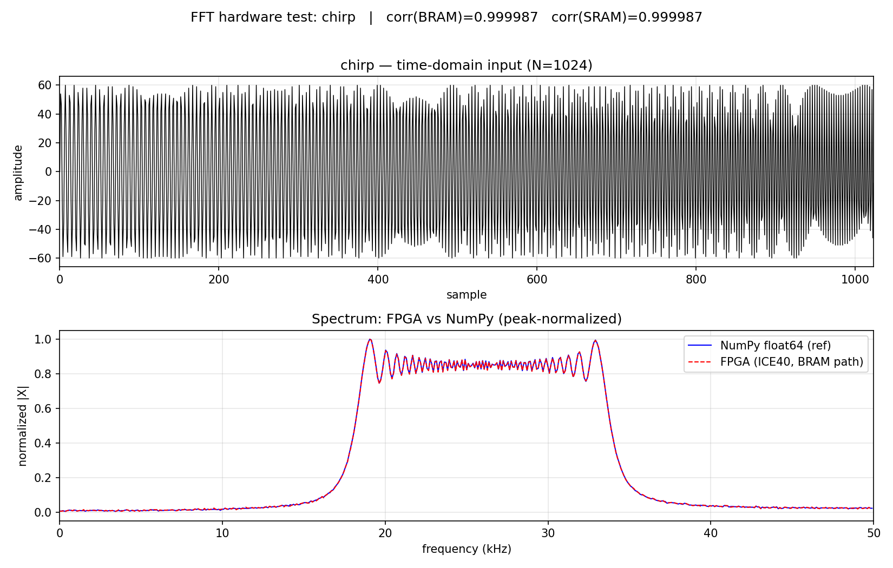

# ICE40 FFT — FPGA-Accelerated FFT for Linux

Hardware-accelerated Fast Fourier Transform on Lattice ICE40HX4K FPGA with Linux kernel driver and FFTW-compatible user-space API.

## Overview

This project provides an end-to-end DSP pipeline: from Verilog RTL running on an ICEZero board to a Linux `libfft.so` library with Python bindings — all built with the fully open-source Project IceStorm toolchain.

- **FPGA**: Lattice ICE40HX4K (3520 LUT4, 32 × 4 kbit BRAM)
- **Board**: Trenz Electronic ICEZero (Raspberry Pi HAT form-factor)
- **FFT size**: 1024-point Radix-2 DIT (configurable via parameter)
- **Data width**: 16-bit Q1.15 fixed-point; **complex (re+im) output** with a
  block-floating-point (BFP) exponent for full dynamic range
- **Accuracy**: BFP + convergent rounding — DC/ramp/sin correlate 1.000000 with
  NumPy, chirp 0.999987 (measured on hardware via both the BRAM `0x41` and the
  SRAM-staged `0x43` input paths)
- **Clocking**: dual-clock — SPI domain **87.5 MHz**, FFT core **43.75 MHz**
  (single `SB_PLL40_2F_PAD`, CDC across the boundary)
- **SPI Protocol**: XOR-checksum framing, reliable up to **14 MHz SCK**
  (re-measured 0/10 bit-exact; 15 MHz+ drops bits). `BULK_READ` (0x23) streams
  the whole spectrum in one transaction — ~1.27× faster readout than chunked.
- **SRAM double-buffer**: each result is copied to external AS6C4008 SRAM, so the
  host streams frame *N* while the core already computes frame *N+1*. Pipelined
  host loop → **2.0× throughput** (~500 FFT/s vs ~246, measured).
- **SRAM-staged input** (`WRITE_SRAM` 0x43): the host can preload the *next* input
  frame into SRAM while the core is busy/being read out (input double-buffer). A
  priority FIFO + input-DMA guarantee no host samples are dropped even during the
  background output copy. Bit-exact with the direct (0x41) path on hardware.
- **Latency** (N=1024): ~1.1 ms compute + ~1.8 ms readout (Hermitian bulk, 14 MHz
  SCK); with overlap the steady-state cost is **~2.0 ms/frame** (compute hidden).

## Quick Start

### Docker (recommended — no local toolchain needed)

```bash
git clone https://github.com/ipmgroup/fftd.git
cd fftd

# Build Docker image & run blinky test
make docker-build
make docker-blinky

# Interactive shell
make docker-shell
```

### Building the C FPGA programmer (icezprog) in Docker

`examples/blinky/icezprog.c` bit-bangs the ICEZero `CFG_*` pins to load a
bitstream into the FPGA SRAM. The C build is ~30× faster than the `RPi.GPIO`
Python version (`icezprog.py`) — SRAM config in ~2.3 s — so it's the preferred
flasher. It runs on the **Pi (aarch64)** and links `liblgpio`, so it's
cross-compiled in the dev image (which ships `liblgpio-dev:arm64`):

```bash
make docker-build                 # one-time: image bakes in arm64 lgpio
make docker-icezprog              # → examples/blinky/icezprog (aarch64 ELF)

# equivalently, inside the container:
docker compose run --rm dev make -C examples/blinky icezprog

# then copy to the Pi and flash a bitstream:
scp examples/blinky/icezprog pi@rpia5.local:/home/pi/fftd/examples/blinky/
ssh pi@rpia5.local "cd /home/pi/fftd && sudo ./examples/blinky/icezprog fft_top.bin"
```

> If you skipped `make docker-build` after pulling these changes, rebuild the
> image first — the arm64 `lgpio` package is added there.

### Native (requires toolchain installation)

```bash
# Install toolchain
./scripts/setup_dev.sh

# Build everything (sim, synth, kernel driver, user lib)
make all

# 4. Deploy to Raspberry Pi + ICEZero
echo "rpia5" > .config/pi_address.txt
./scripts/deploy_to_pi.sh

# 5. Run integration tests
./scripts/test_on_pi.sh
```

## Repository Structure

```
ice40-fft/
├── hardware/           # Verilog RTL, testbenches, synthesis scripts
│   ├── rtl/            # fft_core, axi_lite, fifo, uart, gpio, top
│   ├── sim/            # iverilog/Verilator testbenches
│   └── synth/          # Yosys + nextpnr + pin constraints (.pcf)
├── software/
│   ├── kernel_driver/  # Linux kernel module (UIO)
│   ├── lib/            # libfft.so — C library, FFTW-compatible
│   ├── python/         # pyfft — Python ctypes wrapper
│   └── utils/          # fft_load, fft_test, fft_profile
├── examples/           # C and Python usage examples
├── tests/              # Unit + integration tests (pytest)
├── scripts/            # dev setup, deploy, remote test scripts
└── docs/               # Architecture, API, setup guides
```

## API (C)

```c
#include <fft.h>

fft_handle_t *h = fft_init(64);           // 64-point FFT
fft_compute_forward(h, input, output);     // complex → complex
fft_compute_inverse(h, input, output);     // complex → complex
fft_get_config(h, &cfg);
fft_destroy(h);
```

## API (Python)

```python
from pyfft import FFT

fft = FFT(size=64)
spectrum = fft.forward(data)      # numpy-compatible
reconstructed = fft.inverse(spectrum)
```

## Requirements

| Component | Version |
|-----------|---------|
| Yosys | ≥ 0.30 |
| nextpnr-ice40 | ≥ 0.40 |
| Python | ≥ 3.8 |
| GCC | ≥ 9.0 |
| Linux kernel | ≥ 5.10 (arm64 on Raspberry Pi) |

## Performance (N=1024 FFT)

Benchmark comparing FPGA (ICE40HX4K, dual-clock 87.5/43.75 MHz, 16-bit Q1.15) vs CPU (Raspberry Pi 5, 2.4 GHz Cortex-A76). FPGA compute time measured via SPI status polling, CPU via `perf_counter()` and FFTW3 C API.

| Method | Time/FFT | vs FPGA | Notes |
|--------|----------|---------|-------|
| **FPGA** serial | **~4.0 ms** | 1× | 2.22 ms compute (poll-inflated) + 1.81 ms readout @ 14 MHz (bulk) |
| **FPGA** pipelined | **~2.0 ms** | — | SRAM double-buffer: compute *N+1* hidden under readout *N* → **500 FFT/s** |
| FPGA compute only | ~1.1 ms | — | 43.75 MHz core; measured 2.22 ms is poll-quantized (poll_ms=1) |
| FPGA readout (Hermitian, bulk 0x23) | 1.81 ms | — | 513 complex bins, one transaction @ 14 MHz SCK (chunked: 2.29 ms) |
| numpy.fft float64 | 16 µs | 269× | NEON-optimized, 64-bit float |
| numpy.fft float32 | 16 µs | 272× | NEON-optimized, 32-bit float |
| **FFTW3** float32 | **4.4 µs** | **967×** | C API, `-O3 -march=native` |

**FPGA resources**: 2678/7680 LC — 34% (ICE40HX4K: 3520 LUT4 + 3520 FF; includes the SRAM DMA/read-server), 28/32 BRAM (87%). Fmax: SPI domain ~105 MHz (runs at 87.5), core domain ~70 MHz (runs at 43.75).

**Why CPU is faster for N=1024**:
- 2.4 GHz vs 43.75 MHz = 55× clock advantage
- NEON SIMD: 4× float32 per instruction
- FFTW auto-tunes to optimal algorithm for the specific CPU
- ICE40HX has no hardened DSP/multiplier blocks — the 16×16 butterfly multiply
  is LUT-based, capping the core clock (~73 MHz Fmax)

**Where the FPGA time goes**: readout is now dominated by per-transaction
overhead (9 SPI frames of 63 bins each, limited by the 8-bit LEN field) plus
spidev/Python gaps, not raw SCK — so a streaming-read protocol would help more
than a faster clock.

**When FPGA wins**:
- **Streaming**: zero CPU overhead, deterministic latency
- **Power**: ~0.2 W (FPGA) vs ~5 W (CPU core under FFT load)
- **Larger N**: CPU cache misses increase at N > 4096, FPGA scales linearly
- **Continuous DSP**: FPGA does FFT while CPU is free for other tasks

## Verification

Last full run (2026-06-04) — all suites green:

| Suite | What | Result |
|-------|------|--------|
| RTL sim — `hardware/sim/tb_spi_proto.v` | STATUS/CONFIG/START/READ_RESULT/BULK_READ/**WRITE_SRAM**/checksum | **11/11 passed** |
| RTL sim — `hardware/scripts/chirp_sim_sram.py` | chirp through the full SPI→SRAM→FFT→SRAM→readout path | corr **0.999970** vs numpy |
| HW functional — `hardware/scripts/hw_test_signals.py` | DC / ramp / sin / chirp via **both** BRAM (0x41) & SRAM (0x43) | DC/ramp/sin **1.000000**, chirp **0.999987** — all PASS |
| HW perf — `bench_fft.py` | compute / readout / pipelined throughput | 2.23 ms compute, 1.81 ms readout, **364 FFT/s** pipelined |
| HW perf — `bench_pipeline.py` | compute/readout overlap | serial 4.07 → pipelined **2.00 ms/frame**, **2.03×**, 30/30 correct |
| HW perf — `bench_bulk.py` | chunked vs bulk readout | bit-exact, bulk 1.80 ms vs chunked 2.30 ms (**1.28×**) |

Chirp (18–34 kHz) on real hardware — FPGA spectrum vs NumPy reference (booting from QSPI flash, corr **0.999987**):



```bash
# RTL functional suite (Docker)
docker compose run --rm dev bash -c "cd hardware/sim && make"
# Full-path chirp sim + plot (Docker)
docker compose run --rm dev bash -c "python3 hardware/scripts/chirp_sim_sram.py"
# On the Pi (after flashing the bitstream):
python3 hardware/scripts/hw_test_signals.py     # DC/ramp/sin/chirp, both input paths
python3 hardware/scripts/bench_fft.py           # performance
```

## Hardware

- **ICEZero board** (TE0876-03-A) — $25
- **Raspberry Pi 4/5** — host controller (SPI programming + data exchange via GPIO)
- Total BOM: ~$90

## Development Workflow

```
Dev PC (x86_64)                    Raspberry Pi + ICEZero (HAT)
─────────────                      ─────────────────────────────
  edit → sim → synth      scp/ssh    iceprog (SPI via GPIO)
  cross-compile driver ──────────→  insmod fft_driver.ko
  cross-compile lib    ──────────→  run tests & profile
```

The ICEZero board mounts directly on the Raspberry Pi's 40-pin GPIO header (HAT form-factor). All communication — bitstream loading (via dedicated CFG_* pins, flashed with the cross-compiled `icezprog` in ~2.3 s) and data transfer — happens over SPI (XOR-checksum protocol, up to 14 MHz SCK). No USB or external programmers required.

## Support

If you find this project useful, consider supporting it:

[](https://github.com/sponsors/karu2003)
[](https://www.paypal.com/paypalme/BuckinAndrew)

## License

MIT — see [LICENSE](LICENSE) file.

---

Built with [Project IceStorm](http://www.clifford.at/icestorm/) — the fully open-source FPGA toolchain.
